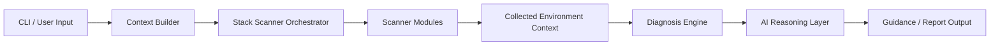

> **RedRing Architecture & Direction**  
> This document is part of the **RedRing** project documentation. It should evolve alongside the codebase and be updated whenever the architecture or project direction changes.

---
# RedRing Architecture

## Overview

RedRing is an AI-assisted developer diagnostics platform focused on helping developers understand and fix environment-specific problems across their toolchain. Instead of guessing, the system inspects the local machine, checks whether the required software or platform prerequisites are present, and then reasons over the evidence to give a grounded answer.

The project is intentionally designed as a modular pipeline: collect system context, run stack-specific scanners, interpret the evidence, and provide actionable guidance.

---

## Product Goal

RedRing exists to answer one core question:

> “Why is my developer environment failing, and what should I do next?”

The system is designed to support a wide range of developer-facing technologies, including:

- Python
- Docker
- Git
- Node.js
- Java
- Rust
- Go
- PostgreSQL
- MySQL
- Redis
- MongoDB
- CUDA
- Android
- Flutter
- Kubernetes

---

## Design Principles

RedRing follows a small set of strong principles:

1. Evidence-first diagnosis
   - The system inspects the environment before offering a recommendation.

2. Developer-centric guidance
   - The output is aimed at practical troubleshooting, not abstract diagnostics.

3. Explainable AI
   - AI should support the conclusion, not replace the underlying evidence.

4. Modular expansion
   - Each supported tech stack should be represented by a scanner or diagnostic module.

5. Safety-oriented behavior
   - If the system needs a BIOS-level change or privileged action, it should explain the step clearly and safely.

---

## High-Level Architecture

---

## Core Components

### 1. CLI Layer

The CLI is the main user entry point. It accepts developer queries such as “diagnose my Docker setup” or “check why PostgreSQL is failing on Linux.”

Responsibilities:

- Parse user requests.
- Select the relevant stack context.
- Trigger the diagnostic workflow.
- Present the result in a clear terminal or structured output.

### 2. Context Builder

The context builder collects the environment information needed for a diagnosis.

Responsibilities:

- Detect the relevant operating system, hardware, and runtime context.
- Determine which stack-specific checks are needed.
- Normalize scanner results into one shared evidence model.

### 3. Scanner Orchestrator

The orchestrator manages which scanners should run based on the user request and the detected environment.

Responsibilities:

- Discover available scanners.
- Build a scan plan.
- Execute scanners in a controlled order.
- Aggregate partial or failed scanner outputs gracefully.

### 4. Stack Scanner Modules

Each scanner is responsible for one domain or one supported developer technology.

Examples include:

- Docker readiness scanner
- Git configuration scanner
- PostgreSQL environment scanner
- Node.js runtime scanner
- Kubernetes or container orchestration checks
- CUDA and GPU compatibility checks

Each scanner should return structured facts such as versions, requirements, missing dependencies, hardware constraints, and connectivity state.

### 5. Diagnosis Engine

The diagnosis engine takes the collected context and converts it into a practical finding.

Responsibilities:

- Match evidence to likely root causes.
- Create severity and confidence signals.
- Produce actionable recommendations.
- Explain how the conclusion was reached.

### 6. AI Reasoning Layer

The AI layer is used to convert raw evidence into natural explanation, guidance, and recommendations.

Responsibilities:

- Summarize the detected problem clearly.
- Suggest next steps for the developer.
- Explain system requirements and environment blockers.
- Provide human-friendly remediation guidance.

The AI layer should never be the only source of truth. It must be grounded in scanner evidence.

### 7. Output Layer

This layer formats final results for the user.

Responsibilities:

- Produce readable terminal output.
- Present root-cause findings and instructions.
- Support future formats such as JSON, markdown, or UI-driven output.

---

## Example Workflow

A typical RedRing use case might look like this:

1. The user asks for help installing Docker.
2. RedRing checks whether the system meets Docker prerequisites.
3. It verifies available RAM and disk space.
4. It checks whether the system has internet connectivity.
5. It inspects whether virtualization is present and enabled.
6. If virtualization is disabled, the diagnosis engine identifies that as the likely blocker.
7. The AI layer translates the evidence into a clear instruction such as:
   “Restart your system, enter BIOS, and enable Virtualization Technology.”
8. The report shows the exact problem, the evidence, and the next action.

---

## Execution Model

RedRing runs as a deterministic evidence pipeline:

1. User request enters through the CLI.
2. The context builder assembles the request-specific environment state.
3. Relevant scanners execute.
4. The diagnosis engine interprets the context.
5. The AI layer explains the diagnosis.
6. The report is returned to the user.

This model keeps the system understandable, testable, and extendable.

---

## Package Structure

The repository is organized around a clean Python package layout:

- `cli/` — command and user-interface entry points
- `config/` — settings and runtime configuration
- `diagnosis/` — problem analysis and evidence interpretation
- `scanners/` — environment and stack scanners
- `reports/` — output formatting and report generation
- `plugins/` — extension points for future integrations
- `ui/` — user-facing interface concerns
- `utils/` — shared helpers and common infrastructure

---

## Future Direction

The architecture is intentionally built to evolve from a focused developer troubleshooting assistant into a broader platform that can support:

- more stack-specific scanners,
- richer diagnostic rules,
- AI explanations with stronger grounding,
- more guided fix instructions,
- plugin-based expansion for new developer tools.

---

## Summary

RedRing’s architecture is centered on a simple developer problem-solving loop:

CLI → Context Builder → Scanner Orchestrator → Stack Scanners → Diagnosis Engine → AI Reasoning → Output

This structure supports the project’s mission: helping developers solve real environment and toolchain issues with evidence-backed, practical guidance.