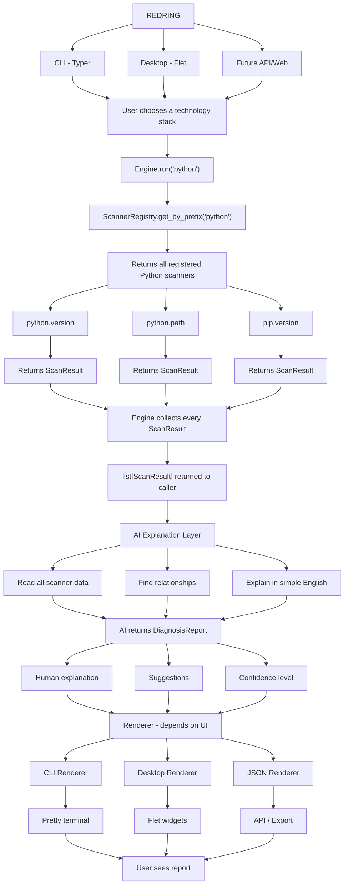

# Architecture
 
RedRing scans a technology stack, collects evidence, and reports what's wrong — optionally with an AI-generated explanation.
 
## Flow
 

 
## Components
 
- **Scanners** — collect evidence for one capability (e.g. `python.version`). Pure data collection, no side effects. Auto-register via `ScannerRegistry`.
- **Engine** — orchestrates scanners for a given stack (`Engine.run("python")`) and collects their `ScanResult`s.
- **AI Explanation Layer** — takes all `ScanResult`s, reasons over them, and returns a `DiagnosisReport` (explanation + suggestions + confidence). Optional — core diagnostics work without it.
- **Renderers** — format the report for CLI, Desktop, or JSON/API output. Adding a new renderer doesn't touch scanners or the engine.
## Design principles
 
- Evidence-first: inspect before recommending
- Explain before fixing
- Modular: new scanners, renderers, or UIs plug in without touching existing code
- Safe by default: no automatic changes without confirmation
## Adding a scanner
 
See [CONTRIBUTING.md](CONTRIBUTING.md) for the scanner template and registration steps.
 
## Full design notes
 
For product goals, supported/planned tech stacks, and design rationale, see the [expanded architecture doc](https://redring.pages.dev/docs.html#docs-architecture) on the website.
