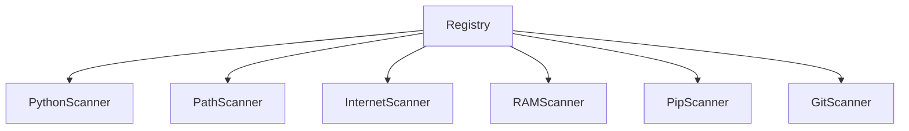
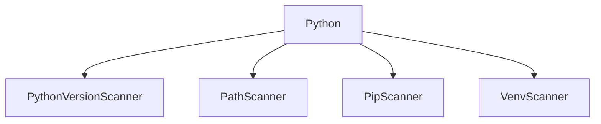
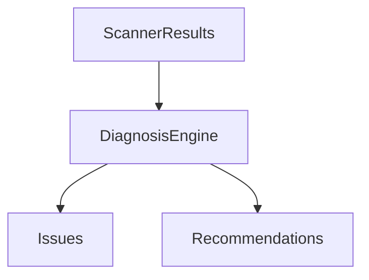
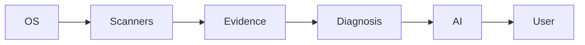

> [!NOTE]
> **RedRing Architecture & Direction**
>
> This document is part of the **RedRing** project documentation. It should evolve alongside the codebase and be updated whenever the architecture or project direction changes.

---

# 🔍 Scanner Specification

This document defines the architecture, responsibilities, and design principles of **Scanners** within the **RedRing** project.

It answers the following questions:

- What is a scanner?
- What does a scanner return?
- What rules must every scanner follow?
- How are scanners discovered?
- How do technologies use scanners?
- How does the diagnosis engine consume scanner results?
- How does AI interact with the collected evidence?

---

# What is a Scanner?

A **Scanner** is an isolated component responsible for collecting **one specific piece of evidence** from the local operating system.

A scanner should perform **only one task**, making it easy to test, maintain, and reuse.

## Examples

| Scanner | Responsibility |
|----------|----------------|
| PythonVersionScanner | Detect installed Python version |
| PathScanner | Read the system PATH |
| PipScanner | Detect installed pip |
| InternetScanner | Check internet connectivity |
| RAMScanner | Collect memory information |

Every scanner is completely independent from every other scanner.

---

# Scanner Responsibilities

A scanner is responsible for:

- Collecting one specific piece of information
- Reading system state
- Returning structured evidence
- Reporting failures safely

A scanner is **not** responsible for:

- Diagnosing problems
- Explaining issues
- Printing output
- Calling AI
- Modifying the operating system

---

# Scanner Output Format

Every scanner returns a structured object instead of plain text.

Example:

```yaml
scanner: PythonVersionScanner

status: PASS

evidence:
  version: "3.14.0"
  executable: "/usr/bin/python"

warnings: []

errors: []
```

---

## Output Fields

| Field | Description |
|--------|-------------|
| `scanner` | Scanner name |
| `status` | PASS, FAIL, WARNING, or UNKNOWN |
| `evidence` | Raw evidence collected from the OS |
| `warnings` | Non-fatal issues |
| `errors` | Errors encountered while scanning |

---

# Scanner Rules

Every scanner **must** obey the following rules.

## Rule 1 — One Scanner, One Responsibility

Each scanner performs exactly **one task**.

✅ Good

- PythonVersionScanner
- PathScanner
- PipScanner

❌ Bad

- PythonEverythingScanner

---

## Rule 2 — Read Only

Scanners must **never modify the system**.

Allowed:

- Read files
- Execute version commands
- Query environment variables

Forbidden:

- Install software
- Delete files
- Change configuration
- Write to disk

Scanners are evidence collectors—not repair tools.

---

## Rule 3 — Never Call AI

Scanners should never invoke any AI model.

Their responsibility ends after collecting evidence.

```
Scanner
    ↓
Evidence
```

Nothing more.

---

## Rule 4 — Never Print Output

Scanners must not print logs or user-facing messages.

Instead of:

```text
Python found!
```

Return structured data.

---

## Rule 5 — Return Structured Results

Never return plain strings.

❌ Bad

```text
Python not found
```

✅ Good

```yaml
status: FAIL

reason: executable_missing

evidence:
  executable: null
```

Structured data is machine-readable, easier to test, and much more reliable.

---

# Scanner Discovery

RedRing should never hardcode scanners.

Avoid code like:

```python
if technology == "python":
    ...
```

Instead, scanners register themselves in a central registry.



Technologies simply query the registry for the scanners they require.

This makes the architecture extensible and avoids special-case logic.

---

# Technology Requirements

Each technology declares which scanners it depends on.

Example:

```text
Python
│
├── PythonVersionScanner
├── PathScanner
├── PipScanner
└── VenvScanner
```

Or visually:



The technology never knows **how** these scanners work—it only consumes their results.

---

# Diagnosis Engine

The Diagnosis Engine never interacts directly with the operating system.

Instead, it reasons using the evidence produced by scanners.



Example:

```text
PythonVersionScanner
PASS

↓

PathScanner
FAIL

↓

Diagnosis Engine

↓

Issue:
Python is installed,
but it is missing from PATH.
```

This separation keeps diagnosis deterministic and easy to test.

---

# AI Integration

AI is the final consumer in the pipeline.

It should **never** receive raw operating system calls.

Instead, it receives structured evidence and diagnosis results.

```mermaid
flowchart TD

Scanners --> Evidence
Evidence --> Diagnosis
Diagnosis --> AI
AI --> Human Explanation
```

Pipeline:

```text
Scanner
      ↓
Evidence
      ↓
Diagnosis
      ↓
AI Explanation
```

This design ensures that AI focuses on interpretation rather than system inspection.

---

# Overall Architecture



Each layer has a single responsibility:

| Layer | Responsibility |
|--------|----------------|
| OS | Source of truth |
| Scanner | Collect evidence |
| Evidence | Structured data |
| Diagnosis | Reason about evidence |
| AI | Explain findings |
| User | Receives final report |

---

# Design Principles

The scanner system follows several core principles:

- **Single Responsibility** — Every scanner performs one task.
- **Read-Only** — Scanners never modify the system.
- **Deterministic** — The same input always produces the same output.
- **Structured Data** — Return objects, never free-form strings.
- **Extensible** — New scanners require no changes to existing code.
- **AI-Independent** — Scanners operate without AI assistance.
- **Composable** — Technologies combine scanners through manifests rather than hardcoded logic.

---

# Summary

The RedRing scanner architecture is built around one simple idea:

> **Scanners collect evidence. They do not think.**

Every scanner:

- Collects one piece of evidence
- Never modifies the system
- Never prints output
- Never calls AI
- Returns structured data
- Registers itself automatically
- Can be reused by any technology

This separation of responsibilities keeps the system modular, testable, extensible, and easy to reason about as RedRing grows.